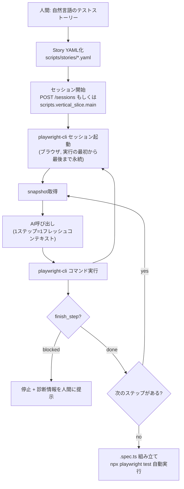
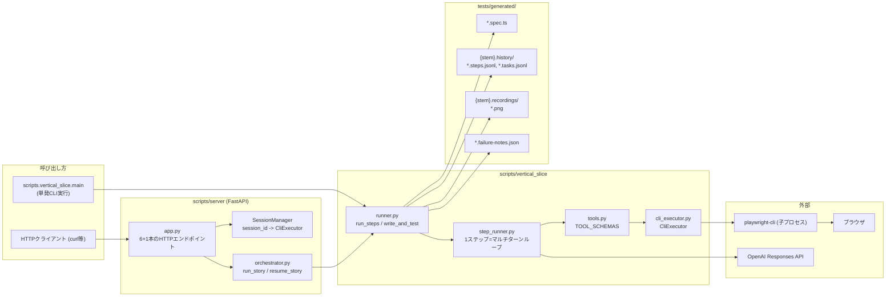
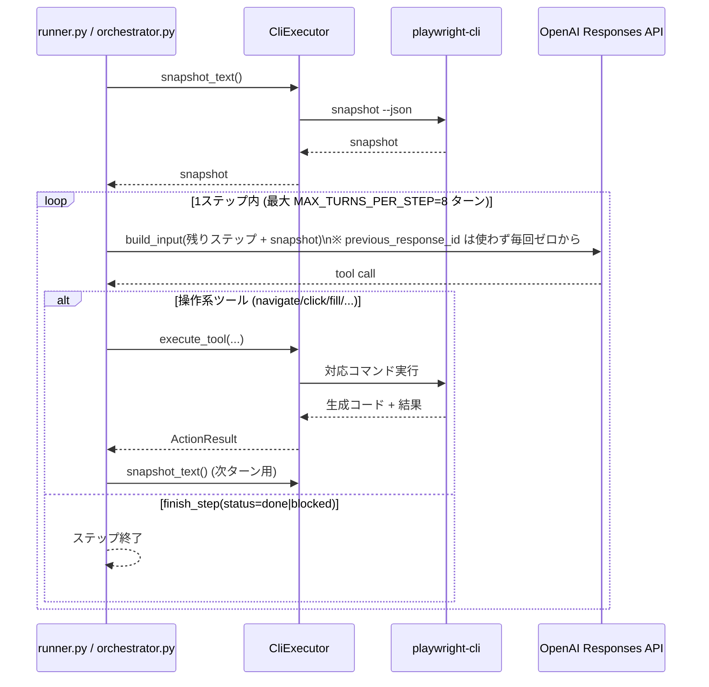
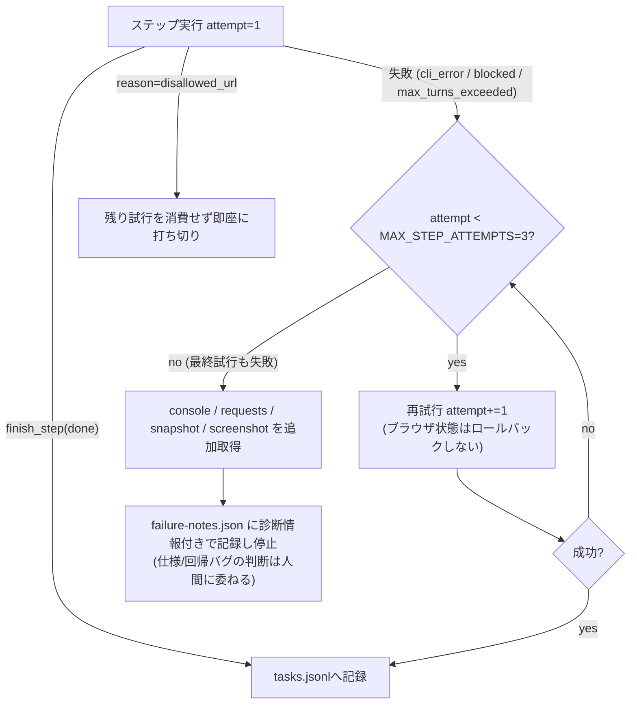
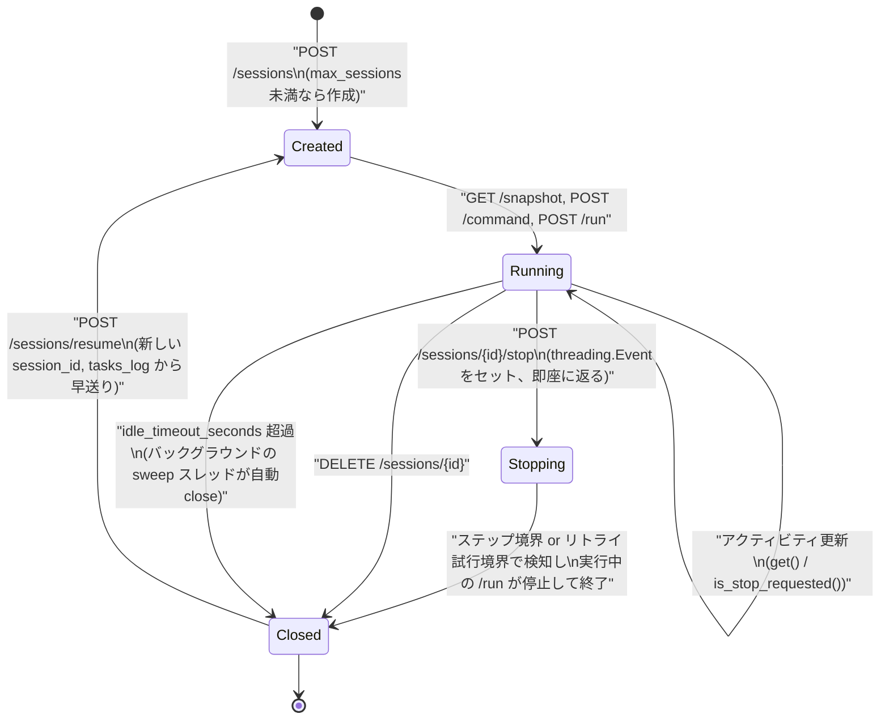

# MERMAID

実装の詳細は `.claude/rules/*.md` を参照。

## 1. 全体の流れ

人間が書いたストーリーから、再実行可能な `.spec.ts` ができるまで。

## 2. コンポーネント構成

## 3. 1ステップ実行のシーケンス

「1タスク＝1ステップ＝1フレッシュコンテキスト」がどう動くか。

## 4. リトライ・失敗時のフロー（Step6）

## 5. セッションのライフサイクル（Step2/7/8）

